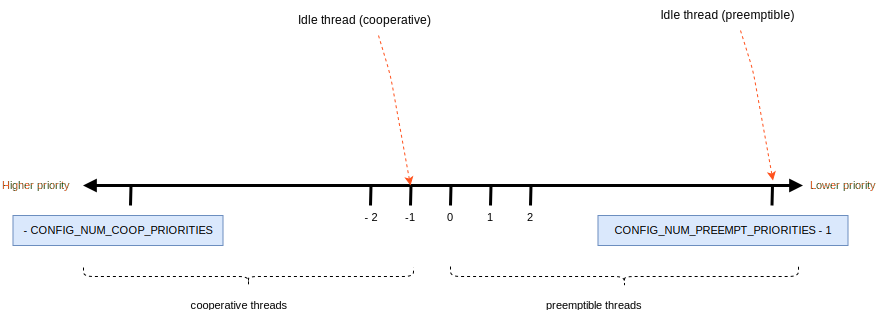

# The Kernel API - Threads

We will now look at the minimum Kernel API required to get going with the Peripherals. We will now look at the Threads API in this section. First the concepts.

## Real-Time System

Real-time systems are characterized by the severe consequences that result if logical as well as timing correctness properties of the system are not met. Two types of real-time systems exist: soft and hard. In a soft real-time system, tasks are performed by the system as fast as possible, but the tasks don’t have to finish by specific times. In hard real-time systems, tasks have to be performed not only correctly but on time. Most real-time systems have a combination of soft and hard requirements. Real-time applications cover a wide range, but most real-time systems are embedded.

Real-time software applications are typically more difficult to design than non-real-time applications. This chapter describes real-time concepts.

## RTOS

What is an RTOS?

RTOSes include a component called the *kernel*. The kernel is responsible for task management in a multitasking system.

Multitasking can be achieved without an RTOS. This can be done in a *super-loop*. Small systems of low complexity are designed this way. It is upto the application to manage the scheduling between tasks. But this is error-prone and most notably, if a code change is made, the timing of the loop is affected.

The RTOS abstracts this away for us. And brings in the concept called *threads*. A firmware designer splits the related work responsible for a portion of the solution to be done into individual threads. The kernel performs the *context switching*, ie: save the current thread context (CPU registers) in the current task storage area then resume execution of new code[^1]. Each thread is assigned a *priority*. Each thread is an infinite loop that can be in any one of the 6 states; see the diagram below.

A task is ready when it can execute but its priority is less than the currently running task. A task is running when it has control of the CPU. A task is waiting when it requires the occurrence of an event (for example, waiting for an I/O operation to complete, a shared resource to be available, a timing pulse to occur, or time to expire). Finally a task is in suspended state when it is explicitly requested by the code (either within itself or another thread).


You may want to ask, when should I use an RTOS?

\- The answer is ALWAYS.
These days the embedded system landscape has changed that such is the case. For example the bluepill[^2] with 128k flash and 20K RAM can be had for a fraction of a dollar.


In addition to the kernel, an RTOS can include device drivers and peripheral management as in the case of Zephyr.
Now that we have an understanding of the kernel and threads, let's see the implementation in Zephyr.

[^1]: This adds overhead, practically the only compromise in using a well designed RTOS

[^2]: https://docs.zephyrproject.org/2.6.0/boards/arm/stm32_min_dev/doc/index.html

## Thread Creation

```
define MY_STACK_SIZE 500
define MY_PRIORITY 5

extern void my_entry_point(void *, void *, void *);

K_THREAD_STACK_DEFINE(my_stack_area, MY_STACK_SIZE);
struct k_thread my_thread_data;

k_tid_t my_tid = k_thread_create(&my_thread_data, my_stack_area,
                                 K_THREAD_STACK_SIZEOF(my_stack_area),
                                 my_entry_point,
                                 NULL, NULL, NULL,
                                 MY_PRIORITY, 0, K_NO_WAIT);
```

The preceding code spawns a thread immediately. We will study the arguments of the above function one at a time.

```&my_thread_data```: this is of type struct ```k_thread``` defined in ```thread.h```. see definition in [docs](https://docs.zephyrproject.org/latest/reference/kernel/threads/index.html#structk__thread).

```my_stack_area```: Pointer to the stack space. 

The above C structs must be initialised using the above shown functions before using in the creation function! See [here](https://docs.zephyrproject.org/latest/reference/kernel/threads/index.html#c.k_thread_create) for more info.

```my_entry_point```: the entry point function (user defined), that takes upto 3 arguments. It's passed 'NULL' in this example.

```MY_PRIORITY```: the priority assigned for this thread. We will discuss priorities in detail below.

```timeout```: the amount of time in milliseconds to wait before the kernel actually starts the thread. Here it's ```K_NO_WAIT```; ie 0.

## Thread Priorities

There are two classes of threads:
- cooperative thread (cannot be pre-empted): negative priority. Ideally used for device drivers and critical work.
- preemptible thread: positive priotity

Note that thread priorities can be changed later in the program. The kernel natively supports unlimited priority levels. But in a real application, it's as follows:



As can be seen, ```CONFIG_NUM_COOP_PRIORITIES``` and ```CONFIG_NUM_PREEMPT_PRIORITIES``` specify the limits of usable priority values for the specific application.

### Notable thread option
- K_ESSENTIAL: if the thread terminates, treat as system failure! default: not enabled.

## Thread termination

Once a thread is started it runs forever. A thread may terminate by returning to the caller. ie 'return x'. The thread must be responsible for releasing any held resourses.
To wait until another thread terminates use ```k_thread_join()```.
```k_thread_abort()``` (ungracefully)  terminates the thread. Can be also used from within an external thread. It's not recommended to use this function as it leads to unfreed resources.

## Notable system threads

These are *essential threads* that are always present in an application.

### main thread

By default has a priority of 0 (highest pre-emptive). Performs kernel initialisation and runs the ```main()``` function.

### idle thread

Executes when no work. Puts the processor to auto- powersave. Always has the lowest priority.

## Delays

Use ```k_sleep()``` to do a delay within a thread. ```k_msleep()``` is a more useful version where you supply the delay in milliseconds. An inactive thread that's in this state can be woken up from another thread prematurely by ```k_wakeup()```. If the delay is too short to warrant pre-emption use the blocking function ```k_busy_wait()```.

## Simple thread example

We will see an example built on the above concepts and study it...

```
#include <zephyr.h>
#include <sys/printk.h>

#define MY_STACK_SIZE 1024
#define MY_PRIORITY 7

void* thread1(void) {
	while(1) {
		printk("thread1\n");
		k_msleep(2000);		// sleep 2s
	}
	return NULL;
}

void* thread2(void) {
	while(1) {
		printk("thread2\n");
		k_msleep(2000);		// sleep 2s
	}
	return NULL;
}

K_THREAD_DEFINE(thread1_id, MY_STACK_SIZE, thread1, NULL, NULL, NULL,
		MY_PRIORITY, 0, 0);
K_THREAD_DEFINE(thread2_id, MY_STACK_SIZE, thread2, NULL, NULL, NULL,
		MY_PRIORITY, 0, 0);

```

The first line includes the 'zephyr.h' file which in turn includes the kernel. Which enables the kernel subsystem which is the subject of our topic here. The second line imports the print subsytem which we use here to print though the UART.

We are writing two individual thread functions (to keep things simple) that'll be invoked next. Here we are using the short-hand method of creating threads whick is functionally similar to the function explained earlier. This is specified in the [docs](https://docs.zephyrproject.org/latest/reference/kernel/threads/index.html#spawning-a-thread).

Open up a terminal and fire-up a *screen* session on the serial device to which the micro:bit is connected to; typically ```/dev/ttyUSB0```. Like so:
```
> screen /dev/ttyUSB0 115200
```
You should see a similar alternating prompt output:
```
thread1
thread2
thread1
thread2
thread1
thread2
thread1
thread2
```

You may note that the board you're using has several uart peripherals (eg. uart1, uart2). The default one that's used is defined in you boards dts file. It's defined as ```zephyr,console```In our case it's the uart2.
