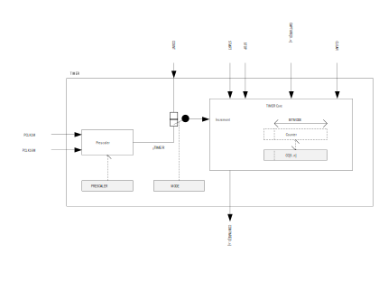

# Timers

Basic timing, there is nothing much to it. We just need a couple of functions for basic timing. If you are familiar with tick based timing in another RTOS, it's exactly the same.

```
// k_uptime_get_32();        // the original 64bit function is blocking and inefficient, use 32bit if possible

int time_stamp;
int milliseconds_spent;

time_stamp = k_uptime_get_32();

<do stuff>

milliseconds_spent = k_uptime_delta(&time_stamp);

```

## Hardware Timers with Interrupts

Some discussion on nRF52 HW timers:



The timer/counter runs on the high-frequency clock source (HFCLK) and includes a four-bit (1/2X) prescaler that can divide the timer input clock from the HFCLK controller. Clock source selection between PCLK16M and PCLK1M is automatic according to TIMER base frequency set by the prescaler. The TIMER base frequency is always given as 16 MHz divided by the prescaler value.


The good thing about Zephyr's timer API (as with other peripheral APIs) is that it abstracts away all the device specific details...

First we acquire the device timer:
In main:
```
	const struct device *counter_dev;

	counter_dev = device_get_binding(TIMER);
	if (counter_dev == NULL) {
		printk("Device not found\n");
		return;
	}
```
where TIMER is bound to an appropriately initiated device in the tree.

Then the basic principle is that we set a callback function using the ```alarm_cfg.callback``` property and setup the 'alarm' using ```counter_set_channel_alarm()```. For this we initiate a ```counter_alarm_cfg``` struct to hold the desired counter settings. Also set the desired delay with ```alarm_cfg.ticks```. See the official [explanation](https://docs.zephyrproject.org/latest/reference/peripherals/counter.html#c.counter_alarm_cfg). Finally call the set alarm function. It has a very similar structure to setting interrupts as seen in the previous topic, considering the alarm is basically an interrupt.

See the sample application in 'samples/drivers/counters/alarm'.