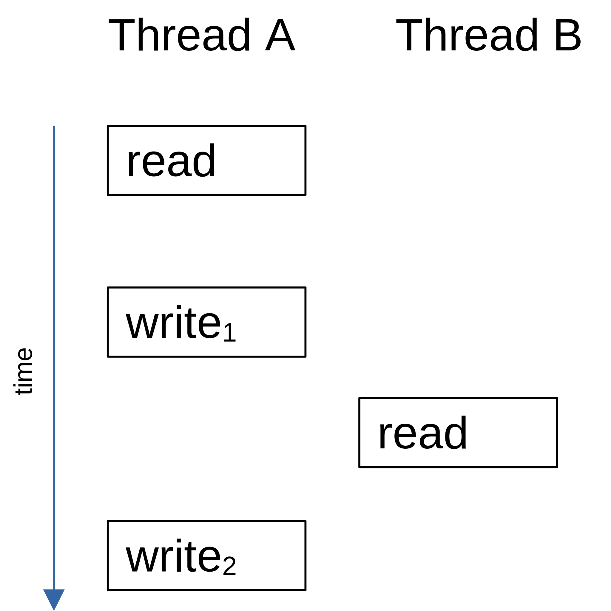

# Semaphores

The easiest way for threads to communicate with each other is through shared data structures. This process is especially easy when all threads exist in a single address space and can reference elements, such as global variables, pointers, buffers, linked lists, and ring buffers, ie use global variables. Although sharing data simplifies the exchange of information, you must ensure that each task has exclusive access to the data to avoid contention and data corruption.

To illustrate the problem, the figure below shows a hypothetical example of two threads reading and writing the same variable. In this example, thread A reads the variable and then writes a new value to it, but the write operation takes two memory cycles. If thread B reads the same variable between the two write cycles, it will see an inconsistent value.



To solve this problem, the threads have to use a lock that will allow only one thread to access the variable at a time.

### Test-and-Set Operations

The simplest way to mitigate this situation. Two functions could agree that to access a resource, they must check a global variable and if the variable is 0, the function has access to the resource. To prevent the other function from accessing the resource, however, the first function that gets the resource sets the variable to 1, which is called a test-and-set (or TAS) operation. We would also have to disable the interrupts however. Pseudocode:

```
Disable interrupts;
if (‘Access Variable’ is 0) {
    Set variable to 1;
    Reenable interrupts;
    Access the resource;
    Disable interrupts;
    Set the ‘Access Variable’ back to 0;
    Reenable interrupts;
} else {
    Reenable interrupts;
    /* You don’t have access to the resource, try back later; */
}
```

## Using Semaphores

A semaphore is a key that your code acquires in order to continue execution. If the semaphore is already in use, the requesting task is suspended until the semaphore is released by its current owner. In other words, the requesting task says: “Give me the key. If someone else is using it, I am willing to wait for it!” Two types of semaphores exist: binary semaphores and counting semaphores. As its name implies, a binary semaphore can only take two values: 0 or 1. A counting semaphore allows values between 0 and < what's the MAX?> In the context of Zephyr, counting semaphores are simply referred as semaphores, while binary semaphores are mutexes(the implementation of which we will see in the next section). Along with the semaphore’s value, the kernel also needs to keep track of tasks waiting for the semaphore’s availability.

A value must be provided when a semaphore is created. This is the desired maximum concurrent threads that can hold the semaphore. Waiting list always starts empty. When a semaphore is accessed by a task this value will get decremented; gradually to zero when no more threads can acquire it... When this happens, we will start seeing threads in the waiting list.

A desired task does a ```WAIT``` operation. Semaphore is checked (if > 0), then decremented and handed over. Else the task waits until a predefined timeout. If the semaphore was busy, when it becomes available the task releases by performing a ```SIGNAL``` operation, the control is yeilded to the waiting task (semaphore is not incremented!). Any number of threads may wait on a locked mutex simultaneously. When the mutex becomes unlocked it is then locked by the highest-priority thread that has waited the longest. If however, the thread wasn't allowed to acquire the semaphore within the specified timeout, the requesting task is allowed to resume, which may then signal an error to the caller.

See the official docs [implementation](https://docs.zephyrproject.org/latest/reference/kernel/synchronization/semaphores.html#implementation) for function definitions. We will now see an example to illustrate the concept...

```
#include <zephyr.h>
#include <sys/printk.h>

#define MY_STACK_SIZE 1024
#define MY_PRIORITY 7

K_THREAD_STACK_DEFINE(my_stack_area, MY_STACK_SIZE);
struct k_thread my_thread_data;

K_THREAD_STACK_DEFINE(my_stack_area1, MY_STACK_SIZE);
struct k_thread my_thread_data1;


struct k_sem my_binary_sem;

void print_thread(void *a, void *b, void *c)
{
    if (k_sem_take(&my_binary_sem, K_MSEC(50)) != 0) {
        printk("Input data not available!");
    } else {
        printk("\nEntered..\n");

        //critical section
        k_msleep(4000);      // sleep 4s

        printk("\nJust Exiting...\n");
    }
}

void main(void)
{
    k_sem_init(&my_binary_sem, 1, 1); // configures a binary semaphore by setting its count to 1 and its limit to 1.

    k_thread_create(&my_thread_data, my_stack_area,
                                 K_THREAD_STACK_SIZEOF(my_stack_area),
                                 print_thread,
                                 NULL, NULL, NULL,
                                 MY_PRIORITY, 0, K_NO_WAIT);

    k_msleep(2000);      // delay 2s
    k_thread_create(&my_thread_data1, my_stack_area1,
                                 K_THREAD_STACK_SIZEOF(my_stack_area1),
                                 print_thread,
                                 NULL, NULL, NULL,
                                 MY_PRIORITY, 0, K_NO_WAIT);
    
    while (1)
    {
        /* code */
    }
    
}
```
Here we are just using a count/limit of 1 (binary semaphore) to keep things simple.

2 threads are being created, one 2 seconds after the first one.
But the first thread will sleep for 4 seconds after acquiring the lock.
Thus the second thread will not enter immediately after it is called, it will enter 4 – 2 = 2 secs after it is called.
And still the output is:
```
Entered..

Just Exiting...

Entered..

Just Exiting...
```
instead of:
```
Entered..

Entered..

Just Exiting...

Just Exiting...
```